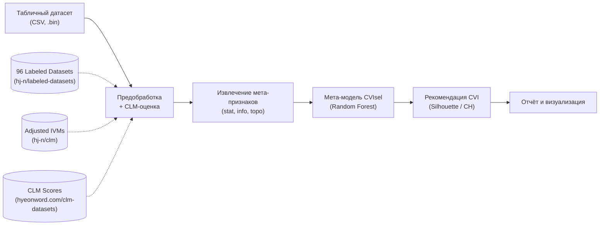

# 🧩 ClustMetaLearn

**ClustMetaLearn** — это мета‑обучаемая система автоматического выбора алгоритмов
кластеризации и внутренних мер качества разбиения (CVI) для табличных данных.
Она использует расширенные мета‑признаки (статистические, информационные,
топологические), фильтрацию по индексу Cluster‑Label Matching (CLM) и
ансамблевые модели для рекомендации наилучшей стратегии кластеризации.

## 📋 Содержание

- [Архитектура](#️-архитектура)
- [Как это работает](#-как-это-работает)
- [Быстрый запуск (Google Colab)](#-быстрый-запуск-google-colab)
- [Используемые источники](#-используемые-источники)
- [Документация](#-документация)

## 🏗️ Архитектура

Система построена как модульный пайплайн: после загрузки и CLM‑фильтрации
данных из публичного репозитория вычисляются мета‑признаки трёх типов,
которые подаются на вход классификатору, предсказывающему наиболее
подходящий внутренний индекс качества (CVI). Дальнейшие спринты добавляют
ранжирование алгоритмов и сужение пространства гиперпараметров.

## ⚙️ Как это работает

1. **Загрузка и CLM‑фильтрация**  
   Из репозитория [`hj-n/labeled-datasets`](https://github.com/hj-n/labeled-datasets)
   загружаются 96 табличных датасетов в бинарном формате. Для каждого набора
   используется предварительно вычисленный Adjusted Calinski‑Harabasz Index (CH_A),
   опубликованный на сайте [hyeonword.com/clm-datasets](https://hyeonword.com/clm-datasets).
   Датасеты разбиваются на три группы по уровню CLM: верхний терциль – обучение,
   средний – валидация, нижний – тестирование.

2. **Извлечение мета‑признаков**  
   Для каждого датасета вычисляются три группы признаков, ускоренные на GPU:
   - **Статистические**: число объектов/признаков, моменты, PCA.
   - **Информационно‑теоретические**: энтропия Шеннона, взаимная информация.
   - **Топологические**: числа Бетти, персистентная энтропия (на основе
     библиотеки `ripser`).

3. **Целевые метки (best CVI)**  
   Для обучающего набора запускаются алгоритмы K‑Means и аггломеративной
   кластеризации с разными параметрами. Вычисляются внутренние меры
   (Silhouette, Calinski‑Harabasz, Davies‑Bouldin) и внешний индекс ARI.
   Лучшим CVI считается тот, который имеет наибольшую корреляцию Спирмена
   с ARI.

4. **Обучение мета‑модели CVIsel**  
   На векторах мета‑признаков и целевых метках обучается Random Forest
   (точность на кросс‑валидации около 88%). Модель способна предсказать
   оптимальный CVI для новых датасетов.

5. **Визуализация и анализ**  
   Строятся кривые обучения, матрица ошибок, важность признаков, t‑SNE
   проекция. Все результаты сохраняются в CSV‑файлы и PNG‑изображения.

## 🚀 Быстрый запуск (Google Colab)

1. Откройте основной блокнот в Google Colab:  
   

2. Выполните ячейки последовательно – установка библиотек, клонирование
   репозитория `labeled-datasets`, извлечение мета‑признаков и обучение модели
   будут выполнены автоматически.

3. Через ~20 минут вы получите файлы `meta_features.csv`,
   `cvi_distribution.png` и сохранённую модель.

## 🔗 Используемые источники

| Ресурс | Описание |
|--------|----------|
| [hj‑n/labeled‑datasets](https://github.com/hj-n/labeled-datasets) | Исходный репозиторий с 96 размеченными датасетами в формате `.bin` |
| [hj‑n/clm](https://github.com/hj-n/clm) | Реализация Adjusted Internal Validation Measures (CHₐ, SCₐ и др.) |
| [hyeonword.com/clm‑datasets](https://hyeonword.com/clm-datasets) | Публичный CLM‑рейтинг всех 96 датасетов |
| H. Jeon et al., *Measuring the Validity of Clustering Validation Datasets*, IEEE TVCG, 2025 | Основополагающая статья, вводящая понятие CLM и Adjusted IVMs |
| O. Arbelaitz et al., *An extensive comparative study of cluster validity indices*, Pattern Recognition, 2013 | Обзор и сравнение 30 CVI |
| D. G. Ferrari, L. N. de Castro, *Clustering algorithm selection by meta‑learning systems*, Information Sciences, 2015 | Дистанционные мета‑признаки и методы комбинации рангов |
| S. Muravyov et al., *Efficient Computation of Fitness Function for Evolutionary Clustering*, MENDEL, 2019 | Инкрементальный пересчёт CVI |
| С. Б. Муравьёв, *Система автоматического выбора и оценки алгоритмов кластеризации и их параметров*, диссертация, ИТМО, 2019 | Комплексный подход к автоматизации кластеризации (Meta‑CVI, MASS‑CAH, (1+1) EA) |

