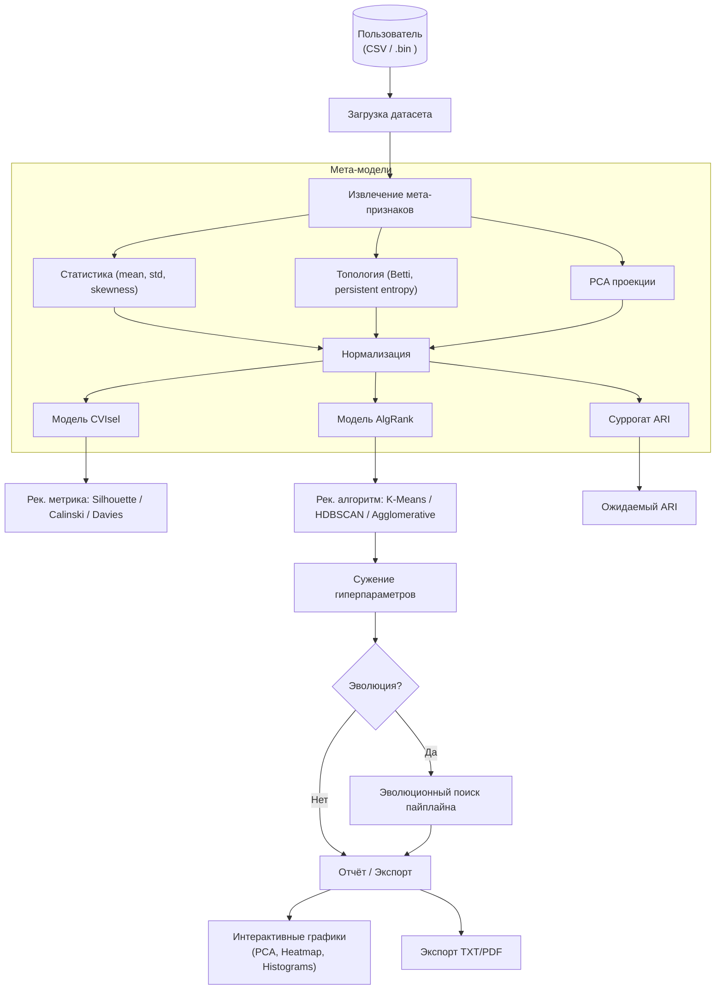

# 🧠 ClustMetaLearn

[](https://www.python.org/)
[](https://www.djangoproject.com/)
[](https://docs.celeryq.dev/)
[](https://www.docker.com/)
[](https://plotly.com/)

**ClustMetaLearn** — система мета-обучения для автоматического подбора стратегии кластеризации табличных данных. Она анализирует датасет, вычисляет 20+ мета-признаков (статистических, топологических, проекционных), рекомендует внутреннюю метрику качества, оптимальный алгоритм, сужает гиперпараметры и при необходимости запускает эволюционный поиск полного пайплайна (предобработка + кластеризация).

Проект включает:
- CLI-инструмент для исследований и скриптовой интеграции.
- Веб-приложение на Django с дашбордом, визуализациями, импортом с Kaggle/Hugging Face, тёмной темой, мультиязычностью (RU/EN) и экспортом отчётов (TXT/PDF).

## 📋 Содержание

- [Архитектура](#-архитектура)
- [Научно-практическое обоснование](#-научно-практическое-обоснование)
- [Быстрый запуск (Docker)](#-быстрый-запуск-docker)
- [Локальная разработка](#-локальная-разработка)
- [Использование CLI](#-использование-cli)
- [Взаимодействие с веб-приложением](#-взаимодействие-с-веб-приложением)
- [Структура проекта](#-структура-проекта)
- [Примеры интерфейса](#-примеры-интерфейса)

## 🏗️ Архитектура


```mermaid
flowchart TD
    User[("Пользователь\n(CSV / .bin )")] --> Upload["Загрузка датасета"]
    Upload --> Extract["Извлечение мета-признаков"]
    
    subgraph META["Мета-модели"]
        Extract --> Stats["Статистика (mean, std, skewness)"]
        Extract --> Topo["Топология (Betti, persistent entropy)"]
        Extract --> PCA["PCA проекции"]
        Stats & Topo & PCA --> Normalize["Нормализация"]
        Normalize --> CVIsel["Модель CVIsel"]
        Normalize --> AlgRank["Модель AlgRank"]
        Normalize --> Surrogate["Суррогат ARI"]
    end

    CVIsel --> Metric["Рек. метрика: Silhouette / Calinski / Davies"]
    AlgRank --> Algorithm["Рек. алгоритм: K-Means / HDBSCAN / Agglomerative"]
    Surrogate --> ARI["Ожидаемый ARI"]
    Algorithm --> Hyper["Сужение гиперпараметров"]
    
    Hyper --> Option{"Эволюция?"}
    Option -- Да --> Evolve["Эволюционный поиск пайплайна"]
    Option -- Нет --> Result["Отчёт / Экспорт"]
    Evolve --> Result

    Result --> Visual["Интерактивные графики\n(PCA, Heatmap, Histograms)"]
    Result --> Export["Экспорт TXT/PDF"]
```

Платформа построена как **модульный пайплайн**:
- **Извлечение мета-признаков** — из CSV или бинарного .bin.
- **Нормализация** и применение предобученных моделей (CVIsel, AlgRank, суррогат ARI).
- **Опциональный эволюционный поиск** на основе TPOT (генетические алгоритмы).
- **Веб-интерфейс** — Django + Celery + Plotly.

## 📊 Научно-практическое обоснование

### Актуальность
Выбор алгоритма кластеризации и настройка гиперпараметров отнимает до 80% времени исследователя. Существующие AutoML-системы ориентированы на задачи с учителем, а методы мета-обучения для кластеризации фрагментарны и не интегрированы в промышленные пайплайны. ClustMetaLearn заполняет этот пробел, предлагая готовое решение с открытым кодом.

### Новизна
- Расширенный вектор из 20+ мета-признаков, включая топологические характеристики (Betti numbers, persistent entropy).
- Двухуровневая мета-модель: CVIsel → AlgRank → суррогат ARI.
- Открытая платформа с CLI и веб-интерфейсом.

### Практическая значимость
- Снижение времени подбора гиперпараметров при сохранении качества кластеризации.
- Сценарии: разведка данных, автоматизация пайплайнов, образование.

## 🐳 Быстрый запуск (Docker)

Самый простой способ запустить веб-приложение вместе с PostgreSQL, Redis и Celery — использовать Docker Compose.

```bash
git clone https://github.com/DanilkaCrazy/ClustMetaLearn.git
cd ClustMetaLearn/clustmetalearn_web

# Создайте .env файл (см. пример ниже)
echo "USE_POSTGRES=True" > .env
echo "USE_CELERY=True" >> .env
echo "DJANGO_SECRET_KEY=supersecretkey" >> .env

docker-compose up --build
```

После запуска:
- **Веб-приложение:** `http://localhost:8000`
- **PostgreSQL:** порт `5432` (внутри контейнера)
- **Redis:** порт `6379`

Для остановки: `docker-compose down`.

## 🖥️ Локальная разработка

Для запуска без Docker (SQLite, синхронная обработка):

```bash
# Перейдите в папку веб-приложения
cd clustmetalearn_web

# Создайте виртуальное окружение
python -m venv .venv
source .venv/bin/activate      # Linux/macOS
.venv\Scripts\activate         # Windows

# Установите зависимости
pip install -r requirements.txt

# Примените миграции
python manage.py migrate

# Скомпилируйте переводы
python manage.py compilemessages

# Запустите сервер
python manage.py runserver
```

Приложение будет доступно на `http://127.0.0.1:8000`. Для доступа к CLI убедитесь, что пакет `clustmetalearn` установлен (см. раздел CLI).

## 🔧 Использование CLI

CLI-инструмент позволяет получать рекомендации и запускать эволюцию без веб-интерфейса.

**Рекомендация для CSV:**
```bash
clust-meta recommend data.csv --models-dir models
```

**Рекомендация для .bin:**
```bash
clust-meta recommend data.bin --input-format bin --n-samples 1000 --n-features 20 --models-dir models
```

**Эволюционный поиск:**
```bash
python -m clustmetalearn.tpot_clustering data.csv --cvisel-models-dir models --generations 10 --population 20
```

Если пакет `clustmetalearn` не установлен, выполните:
```bash
pip install -e ../ClustMetaLearn   # из папки веб-приложения
```
Без пакета эволюция работает в режиме заглушки (имитация прогресса).

## 🎮 Взаимодействие с веб-приложением

После регистрации и входа вы получаете доступ к:

- **Дашборду** — статистика по вашим задачам, график активности, список последних экспериментов.
- **Загрузке датасетов** — файлом (CSV/.bin).
- **Рекомендациям** — метрика, алгоритм, топ‑3, ожидаемый ARI, гиперпараметры.
- **Анализу** — интерактивные графики (PCA, тепловая карта корреляций, гистограммы) с помощью Plotly.
- **Эволюции** — настройка поколений, размера популяции, метрики fitness, стратегии бандита; прогресс-бар и статус.
- **Экспорту отчётов** — TXT или PDF для одного эксперимента или всех.
- **Профилю** — аватар, телефон, компания, тема (светлая/тёмная), язык (RU/EN).

## 📁 Структура проекта

```text
ClustMetaLearn/
├── clustmetalearn_web/                # Веб-приложение Django
│   ├── clustering/                    # Основное приложение
│   │   ├── migrations/                # Миграции БД
│   │   ├── static/                    # CSS, JS (theme.js, i18n.js, upload.js)
│   │   ├── templates/                 # HTML-шаблоны
│   │   │   ├── clustering/
│   │   │   │   ├── includes/          # navbar, sidebar, footer
│   │   │   │   ├── base.html
│   │   │   │   ├── index.html         # лендинг
│   │   │   │   ├── dashboard.html
│   │   │   │   ├── upload.html
│   │   │   │   ├── recommend.html
│   │   │   │   ├── analyze.html
│   │   │   │   ├── evolve.html
│   │   │   │   ├── profile.html
│   │   │   │   ├── about.html
│   │   │   │   ├── docs.html
│   │   │   │   ├── login.html
│   │   │   │   └── register.html
│   │   ├── __init__.py
│   │   ├── admin.py
│   │   ├── apps.py
│   │   ├── forms.py                  # DatasetUploadForm, ProfileForm
│   │   ├── models.py                 # UserProfile, ClusteringTask, EvolutionarySession
│   │   ├── views.py                  # Все представления (лендинг, загрузка, эволюция…)
│   │   ├── tasks.py                  # Celery задачи (эволюция, извлечение признаков)
│   │   ├── utils.py                  # extract_meta_features, predict_clustering_strategy
│   │   ├── dataset_import.py         # Загрузка с Kaggle/Hugging Face
│   │   ├── reports.py                # Генерация TXT/PDF отчётов
│   │   └── urls.py                   # Маршруты
│   ├── clustmetalearn_web/           # Настройки Django
│   │   ├── settings.py
│   │   ├── urls.py
│   │   ├── celery.py
│   │   └── wsgi.py
│   ├── models/                       # Предобученные модели (.joblib, .pkl)
│   ├── media/                        # Загруженные пользователями файлы
│   ├── locale/                       # Переводы (ru/LC_MESSAGES)
│   ├── requirements.txt
│   ├── Dockerfile
│   ├── docker-compose.yml
│   └── manage.py
├── data/                             # Артефакты работы пайплайна (мета-признаки, результаты SMBO)
├── reports/                          # Отчёты по оценке мета-моделей
├── README.md
└── LICENSE
```

## 🖼️ Примеры интерфейса

**Главный лендинг**


**Страница авторизации (Вход)**


**Страница регистрации**


**Панель управления**


**Дашборд с графиками**


**Страница эволюции**


**Страница анализа**


