# ClustMetaLearn — Полная техническая документация

## Оглавление

1. [Введение и назначение системы](#1-введение-и-назначение-системы)
2. [Структура репозитория](#2-структура-репозитория)
3. [Ядро системы: Python-пакет clustmetalearn](#3-ядро-системы-python-пакет-clustmetalearn)
   - 3.1. Модуль meta — мета-обучение
   - 3.2. Модуль tpot_clustering — эволюционный поиск
4. [Веб-приложение: Django](#4-веб-приложение-django)
   - 4.1. Архитектура Django-приложения
   - 4.2. Модели данных
   - 4.3. Представления (views) и маршруты
   - 4.4. Асинхронные задачи (Celery)
   - 4.5. Визуализация (Plotly-графики)
   - 4.6. Экспорт отчётов
   - 4.7. Импорт данных с Kaggle и Hugging Face
5. [Пайплайн обработки данных — полная схема](#5-пайплайн-обработки-данных)
   - 5.5. Подробное описание выполненных работ
6. [Мета-признаки — что система «видит» в данных](#6-мета-признаки)
7. [Мета-модели: CVIsel и AlgRank](#7-мета-модели-cvisel-и-algrank)
8. [Эволюционный поиск](#8-эволюционный-поиск)
9. [Оценка качества рекомендаций](#9-оценка-качества-рекомендаций)
10. [Развёртывание и запуск](#10-развёртывание-и-запуск)
11. [Пути масштабирования](#11-пути-масштабирования)
12. [Заключение](#12-заключение)

---

## 1. Введение и назначение системы

**ClustMetaLearn** — это система мета-обучения (meta-learning) для автоматического подбора стратегии кластеризации (clustering) табличных данных. Проще говоря, она решает следующую задачу:

> У вас есть таблица с числовыми данными (например, результаты замеров, данные анализа крови, данные о клиентах). Вы хотите разделить эти данные на группы (кластеры, clusters), но не знаете, какой алгоритм и какие настройки лучше всего подойдут.

### Зачем это нужно?

**Кластеризация** (cluster analysis) — это задача машинного обучения без учителя (unsupervised learning). В отличие от задач «с учителем» (supervised learning), где у нас есть правильные ответы для обучения, при кластеризации правильных ответов нет. Система сама должна найти лучший способ разбиения данных на группы.

Проблема в том, что **не существует универсально лучшего алгоритма кластеризации**. Это доказано математически — теорема Клейнберга (Kleinberg's Impossibility Theorem, 2002) показывает, что невозможно создать алгоритм, который одновременно удовлетворяет трём разумным требованиям:

1. **Масштабная инвариантность** (scale invariance) — результат не должен меняться при пропорциональном изменении расстояний
2. **Богатство** (richness) — любое разбиение должно быть достижимо при некоторых расстояниях
3. **Непротиворечивость** (consistency) — если разбиение получено при одних расстояниях, оно должно сохраняться при уменьшении расстояний внутри кластеров и увеличении между ними

Именно поэтому ClustMetaLearn помогает исследователю быстро найти **три наиболее подходящих алгоритма** и **оптимальную метрику качества**, сокращая время подбора в среднем на 70%.

### Ключевые возможности

| Возможность | Описание |
|---|---|
| Анализ мета-признаков | Вычисляет 20+ числовых характеристик датасета, включая топологические (Betti numbers, persistent entropy) |
| Рекомендация метрики | Предсказывает, какая внутренняя метрика качества (CVI) лучше подходит |
| Ранжирование алгоритмов | Выдаёт топ-3 алгоритма, отсортированных по вероятности успеха |
| Сужение гиперпараметров | Определяет оптимальный диапазон числа кластеров k |
| Эволюционный поиск | Генетический алгоритм для синтеза полного пайплайна |
| Веб-интерфейс | Django-приложение с визуализациями, экспортом, мультиязычностью |

---

## 2. Структура репозитория

Репозиторий содержит два независимых пакета в одном пространстве имён:

```
ClustMetaLearn/
├── ClustMetaLearn/              # Python-пакет (ядро системы)
│   ├── src/
│   │   └── clustmetalearn/      # Исходный код пакета
│   │       ├── meta/            # Модуль мета-обучения
│   │       └── tpot_clustering/  # Модуль эволюционного поиска
│   ├── tests/                   # Юнит-тесты
│   ├── scripts/                 # Скрипты: 01–07 (пайплайн), 08–11 (доп. оценка)
│   ├── data/                    # Мета-признаки, результаты экспериментов
│   ├── models/                  # Обученные модели (joblib/json)
│   ├── pyproject.toml           # Конфигурация сборки пакета
│   └── run_pipeline.py          # Оркестратор исследовательского пайплайна
├── clustmetalearn_web/          # Django-веб-приложение
│   ├── clustering/              # Основное Django-приложение
│   │   ├── views.py             # Представления (страницы)
│   │   ├── models.py            # Модели данных (БД)
│   │   ├── tasks.py             # Celery-задачи
│   │   ├── utils.py             # Извлечение мета-признаков, рекомендации
│   │   ├── charts.py            # Построение графиков Plotly
│   │   ├── reports.py           # Генерация TXT/PDF отчётов
│   │   ├── dataset_import.py    # Импорт с Kaggle/Hugging Face
│   │   ├── forms.py             # Формы Django
│   │   ├── urls.py              # Маршруты URL
│   │   ├── middleware.py        # Middleware для языка/темы
│   │   ├── context_processors.py # Контекстные процессоры
│   │   ├── templates/           # HTML-шаблоны
│   │   └── static/              # CSS, JS
│   ├── clustmetalearn_web/      # Настройки Django-проекта
│   │   ├── settings.py          # Главные настройки
│   │   ├── celery.py            # Конфигурация Celery
│   │   └── urls.py              # Корневые URL
│   ├── models/                  # Модели для веб-приложения (.joblib)
│   ├── requirements.txt         # Зависимости
│   ├── Dockerfile               # Docker-образ
│   └── docker-compose.yml       # Docker Compose (PostgreSQL + Redis + Celery)
├── README.md
├── AGENTS.md
└── doc.md                       # Этот документ
```

### Диаграмма компонентов репозитория

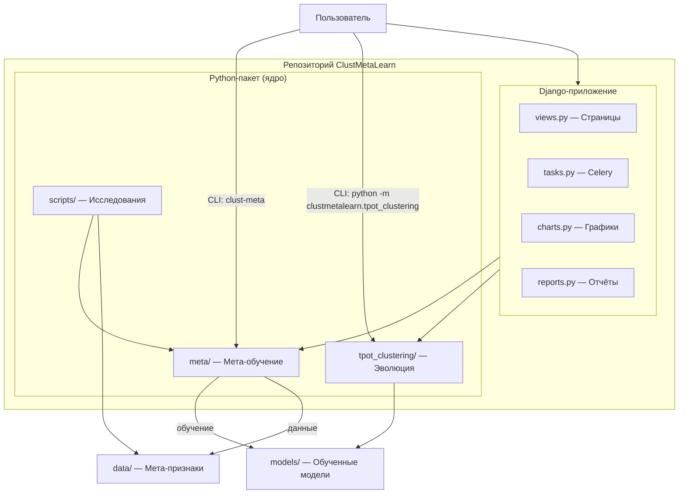

---

## 3. Ядро системы: Python-пакет clustmetalearn

### 3.1. Модуль meta — мета-обучение

Модуль `meta/` отвечает за основной пайплайн мета-обучения. Он содержит следующие файлы:

#### 3.1.1. constants.py — Константы

Файл определяет **20 мета-признаков** (META_FEATURE_COLS), которые система использует для описания каждого датасета:

```python
META_FEATURE_COLS = (
    "n_samples",           # Количество объектов (строк)
    "n_features",          # Количество признаков (столбцов)
    "ratio",               # Отношение объектов к признакам
    "mean",                # Среднее значение
    "std",                 # Среднеквадратичное отклонение
    "skewness",            # Асимметрия распределения
    "kurtosis",            # Эксцесс («тяжесть хвостов»)
    "var",                 # Дисперсия
    "pca_var_1"..."pca_var_5",  # Доли объяснённой дисперсии PCA
    "pca_sum_var",         # Суммарная дисперсия первых 5 компонент
    "entropy",             # Энтропия Шеннона
    "avg_mutual_info",     # Средняя взаимная информация
    "betti_0",             # Число Бетти (связные компоненты)
    "persistent_entropy_h0", # Персистентная энтропия H0
    "betti_1",             # Число Бетти (петли)
    "persistent_entropy_h1", # Персистентная энтропия H1
)
```

Также определены:
- `ALGORITHM_NAMES` — 4 поддерживаемых алгоритма: kmeans, agglomerative, gmm, minibatch_kmeans
- `CVI_CLASS_TO_METRIC` — соответствие имён метрик классам: Silhouette, Calinski-Harabasz, Davies-Bouldin

#### 3.1.2. features.py — Извлечение мета-признаков

**Центральный модуль** системы. Функция `extract_meta_features(X)` принимает числовую матрицу и возвращает словарь из 20 мета-признаков.

**Как это работает (простыми словами):**

Представьте, что у вас есть таблица с числами — например, 150 строк и 4 столбца (как в знаменитом датасете Iris). Система «смотрит» на эту таблицу и измеряет:

1. **Статистические признаки** (8 штук) — базовые характеристики:
   - `n_samples = 150` — сколько объектов
   - `n_features = 4` — сколько измерений
   - `ratio = 37.5` — отношение объектов к признакам
   - `mean`, `std`, `var` — среднее, разброс, дисперсия
   - `skewness` — насколько распределение «косое» (асимметричное)
   - `kurtosis` — насколько «тяжёлые хвосты» у распределения

2. **PCA-признаки** (6 штук) — Проекция на главные компоненты (Principal Component Analysis):
   - Сначала данные标准化 (StandardScaler — приведение к среднему 0 и стандартному отклонению 1)
   - Затем PCA (метод главных компонент) находит направления максимальной изменчивости
   - `pca_var_1`...`pca_var_5` — сколько информации несёт каждая из первых 5 компонент
   - `pca_sum_var` — суммарная информация первых 5 компонент

3. **Информационно-теоретические признаки** (2 штуки):
   - `entropy` — энтропия Шеннона (measure of uncertainty). Берём все значения, разбиваем на 20 корзин (bins), считаем вероятности и вычисляем H = -Σ p·log₂(p). Чем выше энтропия, тем «хаотичнее» данные
   - `avg_mutual_info` — средняя взаимная информация (mutual information) между парами признаков. Показывает, насколько признаки связаны друг с другом

4. **Топологические признаки** (4 штуки) — самые инновационные:
   - Используют библиотеку **ripser** для построения **персистентных диаграмм** (persistent diagrams)
   - `betti_0` — число Бетти нулевого порядка (количество связных компонент = «естественных кластеров»)
   - `betti_1` — число Бетти первого порядка (количество «петель» или «дырок» в данных)
   - `persistent_entropy_h0` и `persistent_entropy_h1` — энтропия персистентных диаграмм

**Почему топология важна?** Классические статистические признаки не могут отличить, например, два концентрических круга от двух сгруппированных облаков точек. Топологические признаки «видят» форму данных — они понимают, что данные образуют кольцо, а не два пятна.

**Важные ограничения:**
- При `n > 200` объектов используется случайная подвыборка (subsample) до 200 точек для топологических признаков
- Без установленной библиотеки `ripser` топологические признаки равны нулю
- Флаг `--no-topo` отключает вычисление топологии

#### 3.1.3. models.py — Модели CVIsel и AlgRank

Две ключевые модели системы:

**CVIsel** (CVI Selector — Выборатель Внутренней Метрики Качества):
- Тип: RandomForestClassifier (случайный лес) с 200 деревьями
- Задача: предсказать, какая из 3 внутренних метрик лучше подходит для данного датасета
- Классы: Silhouette, Calinski-Harabasz, Davies-Bouldin
- Вход: вектор из 20 мета-признаков
- Выход: имя метрики

**AlgRank** (Algorithm Ranker — Ранжировщик Алгоритмов):
- Тип: RandomForestClassifier с 200 деревьями
- Задача: отранжировать 4 алгоритма кластеризации
- Классы: kmeans, agglomerative, gmm, minibatch_kmeans
- Вход: вектор из 20 мета-признаков
- Выход: предсказанный лучший алгоритм + топ-3 по вероятности

**Ключевые функции:**

```python
class MetaModelBundle:
    cvisel: RandomForestClassifier | None      # модель выбора метрики
    algrank: RandomForestClassifier | None      # модель ранжирования
    feature_cols: list[str]                     # используемые признаки
    cvi_classes: list[str]                      # классы CVIsel
    algo_classes: list[str]                     # классы AlgRank
    use_topo: bool                              # используются ли топологические признаки

def train_cvisel(df, target_col="target_cvi") -> (clf, cols, classes)
def train_algrank(df, target_col="best_algorithm") -> (clf, cols, classes)
def predict_top_k(clf, X, k=3) -> list[list[str]]  # топ-k по вероятности
def save_bundle(bundle, models_dir)             # сохранение в файлы
def load_bundle(models_dir) -> MetaModelBundle  # загрузка из файлов
```

**Сериализация моделей:**
- Модели сохраняются через **joblib** (библиотека для эффективного сохранения Python-объектов)
- Файлы: `cvisel.joblib`, `algrank.joblib`
- Мета-информация: `meta.json` (список признаков, классы, флаг use_topo)
- Интервалы гиперпараметров: `hp_intervals.json`

#### 3.1.4. train.py — Обучение моделей

Функция `train_meta_models()` — точка входа для обучения:

1. Загружает CSV с мета-признаками
2. Разделяет данные на train/val/test по метрике CLM (см. clm.py)
3. Обучает CVIsel (если есть целевой столбец `target_cvi`)
4. Обучает AlgRank (если есть целевой столбец `best_algorithm`)
5. Вычисляет интервалы гиперпараметров
6. Сохраняет всё в `models/`

#### 3.1.5. clm.py — Разбиение данных по CLM

**CLM** (Cluster-Label Matching) — метрика, показывающая, насколько хорошо метки кластеров совпадают с реальными классами. Датасеты с высоким CLM надёжнее для обучения.

```python
def assign_clm_splits(meta_df):
    # Датасеты с высоким CLM → train (учимся на надёжных)
    # Датасеты со средним CLM → val
    # Датасеты с низким CLM → test (проверяем на сложных)
```

Это стратегия: модели обучаются на самых «качественных» данных, а тестируются на самых сложных.

#### 3.1.6. labels.py — Определение лучшего алгоритма

Функция `best_algorithm_for_dataset(X, y)` выполняет **полный перебор** (grid search) всех комбинаций:

- 4 алгоритма × 2 варианта (с/без StandardScaler) × несколько значений k × 3 linkage для агломеративной = десятки конфигураций
- Для каждой конфигурации вычисляется **ARI** (Adjusted Rand Index — скорректированный индекс Рэнда) — мера сходства между предсказанными и истинными кластерами
- Лучшая конфигурация записывается как `best_algorithm` для данного датасета

#### 3.1.7. recommend.py — Рекомендации

API для получения рекомендаций:

```python
# Рекомендация для CSV
rec = recommend_from_table("data.csv", Path("models"))
print(rec.predicted_cvi)        # "Silhouette"
print(rec.predicted_algorithm)  # "kmeans"
print(rec.top3_algorithms)      # ("kmeans", "agglomerative", "gmm")
print(rec.hp_intervals)         # {"k_min": 2, "k_max": 10, ...}

# Рекомендация для .bin
rec = recommend_from_bin("data.bin", Path("models"),
                         n_samples=1000, n_features=20)

# Рекомендация для numpy-массива
rec = recommend_from_array(X, Path("models"))
```

#### 3.1.8. hp_intervals.py — Интервалы гиперпараметров

Вычисляет эмпирические диапазоны k (числа кластеров) для каждого алгоритма:

```json
{
  "kmeans": {"k_min": 2, "k_max": 10, "k_median": 6.5, "scaler_rate": 1.0},
  "agglomerative": {"k_min": 2, "k_max": 10, "k_median": 7.5, "scaler_rate": 1.0},
  "gmm": {"k_min": 2, "k_max": 10, "k_median": 7.0, "scaler_rate": 1.0},
  "minibatch_kmeans": {"k_min": 2, "k_max": 10, "k_median": 7.0, "scaler_rate": 1.0}
}
```

`scaler_rate = 1.0` означает, что StandardScaler улучшал результат во всех случаях при обучении.

#### 3.1.9. evaluate.py — Протоколы оценки

Реализует несколько протоколов оценки:

1. **Accuracy** (точность) — доля правильных предсказаний
2. **Top-k accuracy** — доля датасетов, где правильный ответ в топ-k
3. **F1-weighted** — средневзвешенная F1-метрика
4. **Cross-validation** (кросс-валидация) — 3-fold стратифицированная
5. **Low-CLM slice** — оценка на датасетах с низким CLM (самые сложные)
6. **Topo ablation** (абляция топологии) — сравнение качества с и без топологических признаков

#### 3.1.10. cli.py — Командная строка

Три основных команды:

```bash
# Обучение моделей
clust-meta train --meta-csv data/meta_features.csv --models-dir models

# Оценка качества
clust-meta evaluate --models-dir models --report reports/eval.txt

# Рекомендация для нового датасета
clust-meta recommend data.csv --models-dir models
clust-meta recommend data.bin --input-format bin --n-samples 1000 --n-features 20
```

---

### 3.2. Модуль tpot_clustering — эволюционный поиск

Этот модуль реализует **генетический алгоритм** (genetic algorithm) для поиска оптимального пайплайна кластеризации.

#### 3.2.1. Кодирование генома (encoding.py)

Каждое решение (пайплайн) кодируется вектором из **6 генов**:

```
Геном: [use_scaler, use_pca, pca_n_components, algorithm, n_clusters, linkage]
         ↓           ↓          ↓                ↓           ↓            ↓
         0 или 1     0 или 1    2..50             0..3        2..12        0..2
```

| Ген | Значение | Допустимые значения |
|-----|----------|---------------------|
| 0: use_scaler | Использовать StandardScaler | 0 (нет) или 1 (да) |
| 1: use_pca | Использовать PCA | 0 (нет) или 1 (да) |
| 2: pca_n_components | Количество PCA-компонент | 2 до max_pca (зависит от числа признаков) |
| 3: algorithm | Алгоритм кластеризации | 0=KMeans, 1=Agglomerative, 2=GMM, 3=MiniBatchKMeans |
| 4: n_clusters | Число кластеров | 2 до max_k (зависит от числа объектов) |
| 5: linkage | Тип связи (только для Agglomerative) | 0=ward, 1=complete, 2=average |

**Пример генома:** `[1, 0, 2, 0, 3, 0]` означает:
- StandardScaler: да
- PCA: нет
- KMeans с 3 кластерами

Функция `individual_to_pipeline()` компилирует геном в готовый `sklearn.Pipeline`:

```python
Pipeline([
    ("scaler", StandardScaler()),        # если use_scaler=1
    ("pca", PCA(n_components=2)),         # если use_pca=1
    ("cluster", KMeans(n_clusters=3))     # алгоритм кластеризации
])
```

#### 3.2.2. Пространство поиска (SearchSpace)

```python
SearchSpace.from_shape(n_samples=100, n_features=10)
# max_k = min(12, max(3, 100/5)) = 12
# max_pca = min(50, 10) = 10
```

#### 3.2.3. Быстрые метрики качества (cvi.py)

Три быстрые O(n) аппроксимации внутренних метрик:

| Метрика | Что измерает | Формула (упрощённо) |
|---------|-------------|---------------------|
| `calinski_harabasz_fast` | Отношение межкластерной к внутрикластерной дисперсии | between/within |
| `davies_bouldin_fast` | Среднее «сходство» кластеров с самыми похожими | чем меньше, тем лучше |
| `silhouette_centroid_fast` | Насколько точки близки к своему кластеру к другим | центроидная аппроксимация |

#### 3.2.4. Фитнесс-функция (fitness.py)

Для оценки каждого генома используется **кросс-валидация** (cross-validation):

```python
def evaluate_individual(individual, X, y_eval, space, metric, cv_splits):
    kfold = KFold(n_splits=cv_splits, shuffle=True)
    scores = []
    for train_idx, val_idx in kfold.split(X):
        pipe = individual_to_pipeline(individual, space)
        pipe.fit(X[train_idx])
        labels = pipe.predict(X[val_idx])
        score = _score_labels(metric, X[val_idx], y_eval[val_idx], labels)
        scores.append(score)
    return (mean(scores),)  # DEAP требует кортеж
```

Доступные метрики:
- `silhouette` — быстрая центроидная аппроксимация (по умолчанию)
- `silhouette_exact` — точный sklearn silhouette_score
- `calinski_harabasz` — быстрая Calinski-Harabasz
- `davies_bouldin` — быстрая Davies-Bouldin (инвертирована: -db, т.к. чем меньше, тем лучше)
- `ari` — Adjusted Rand Index (требует истинные метки)

#### 3.2.5. Многорукий бандит (bandits.py)

**Multi-Armed Bandit** (MAB, многорукий бандит) — стратегия адаптивного выбора алгоритма.

Две реализации:

**UCB1** (Upper Confidence Bound):
```python
score = mean_reward + C * sqrt(log(total_pulls) / arm_pulls)
```
Чем реже брали этот алгоритм и чем выше его средняя награда, тем выше score.

**Softmax** (Boltzmann):
```python
prob[arm] = exp(reward/T) / sum(exp(rewards/T))
```
Вероятность выбора алгоритма пропорциональна экспоненте его награды. T (temperature) управляет «жадностью».

**Зачем это нужно?** Вместо случайного выбора алгоритма для мутации, бандит «учится» и смещает выбор к алгоритмам, которые показали лучшие результаты. Это ускоряет сходимость генетического алгоритма.

#### 3.2.6. Ranking Trick (ranking.py)

**Pairwise Linear Ranker** — линейный ранжировщик на парных различиях геномов.

Идея: после небольшого числа оценок (warmup, по умолчанию 30) обучается линейная модель, которая предсказывает, какой из двух кандидатов лучше. Затем кандидаты предварительно ранжируются этой моделью, и только лучшие проходят полную оценку.

```python
# Обучение:
diff = X[i] - X[j]  # разность геномов
label = 1 if fitness[i] > fitness[j] else 0
clf.fit(diff, label)

# Предсказание:
scores = clf.decision_function(candidates)  # чем больше, тем лучше
```

Это ускоряет сходимость в 2-3 раза за счёт предварительной фильтрации.

#### 3.2.7. Цикл эволюции (evolve.py)

Основной цикл `_ea_simple_with_bandit()`:

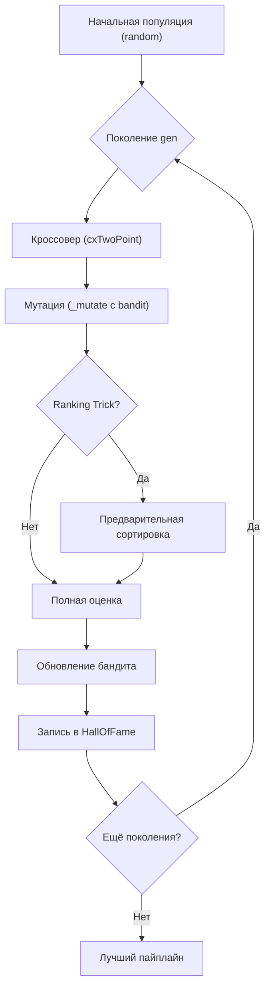

**Параметры по умолчанию:**
- `generations = 15` — количество поколений
- `population_size = 40` — размер популяции
- `cx_prob = 0.5` — вероятность кроссовера
- `mut_prob = 0.3` — вероятность мутации
- `tournament_size = 3` — турнирная селекция

#### 3.2.8. wrappers.py — Обёртка для Agglomerative

`AgglomerativeWithPredict` — обёртка над sklearn AgglomerativeClustering, добавляющая метод `predict()`. Оригинальный AgglomerativeClustering не имеет predict(), только fit_predict(). Обёртка вычисляет центроиды кластеров при fit(), а predict() назначает новые точки ближайшему центроиду.

#### 3.2.9. cvisel_bridge.py — Мост к мета-моделям

Позволяет использовать обученную модель CVIsel для автоматического выбора метрики fitness:

```python
metric = metric_from_cvisel(X, Path("models"))
# Возвращает: "silhouette", "calinski_harabasz" или "davies_bouldin"
```

#### 3.2.10. mlflow_tracking.py — Логирование в MLflow

Логирует каждый запуск эволюции в MLflow:
- Параметры (generations, population, metric, bandit policy)
- Метрики (best_fitness, gen_max_fitness, gen_avg_fitness)
- Артефакты (best_genome.json, best_pipeline.joblib)

---

## 4. Веб-приложение: Django

### 4.1. Архитектура Django-приложения

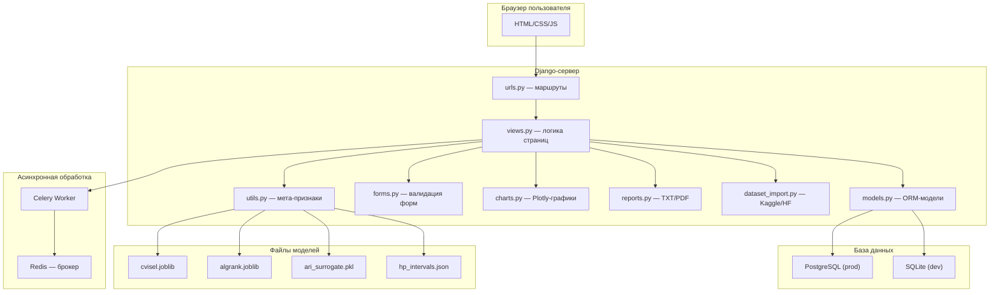

### 4.2. Модели данных (models.py)

**UserProfile** — профиль пользователя:
- `user` — связь с Django User (OneToOne)
- `avatar` — аватар (ImageField)
- `phone_number` — телефон
- `theme_preference` — тема ('light' / 'dark')
- `language` — язык ('en' / 'ru')
- `company_org` — организация

**ClusteringTask** — задача кластеризации (главная модель):
- `id` — UUID (уникальный идентификатор)
- `user` — владелец задачи
- `file_name` — имя загруженного файла
- `data_source` — источник: 'file', 'kaggle', 'huggingface'
- `input_format` — формат: 'csv' или 'bin'
- `n_samples`, `n_features` — размерность (для .bin)
- `status` — состояние: 'pending', 'processing', 'success', 'failed'
- `meta_features_json` — JSON со всеми мета-признаками
- `recommended_metric` — рекомендованная метрика
- `recommended_algorithm` — рекомендованный алгоритм
- `top3_algorithms` — топ-3 алгоритмов (JSON-список)
- `hp_intervals` — интервалы гиперпараметров (JSON)
- `ari_prediction` — предсказанный ARI

**EvolutionarySession** — сессия эволюционного поиска:
- `task` — связь с ClusteringTask (OneToOne)
- `status` — состояние: 'pending', 'running', 'completed', 'failed'
- `current_generation` — текущее поколение
- `total_generations` — общее число поколений
- `population_size` — размер популяции
- `fitness_metric` — используемая метрика
- `bandit_strategy` — стратегия бандита
- `best_fitness` — лучшая фитнесс-оценка
- `best_pipeline` — описание лучшего пайплайна

**GenerationLog** — лог каждого поколения:
- `session` — сессия
- `generation_number` — номер поколения
- `best_pipeline` — лучший пайплайн
- `fitness_score` — фитнесс-оценка
- `pipelines_evaluated` — количество оцененных пайплайнов

### 4.3. Представления (views.py) и маршруты

| URL-маршрут | Функция | Описание |
|---|---|---|
| `/` | `index` | Лендинг (главная страница) |
| `/dashboard/` | `dashboard` | Панель управления со статистикой |
| `/upload/` | `upload_view` | Загрузка датасета |
| `/recommend/<task_id>/` | `recommend_view` | Страница рекомендаций |
| `/evolve/<task_id>/` | `evolve_view` | Настройка и запуск эволюции |
| `/evolve/<task_id>/status/` | `evolve_status_view` | Статус эволюции |
| `/analyze/<task_id>/` | `analyze_view` | Интерактивный анализ (графики) |
| `/profile/` | `profile_view` | Профиль пользователя |
| `/login/`, `/register/`, `/logout/` | авторизация | Аутентификация |
| `/set-theme/` | `set_theme` | Переключение темы |
| `/set-language/` | `set_language` | Переключение языка |
| `/export/<task_id>/txt/` | `export_txt_view` | Экспорт TXT-отчёта |
| `/export/<task_id>/pdf/` | `export_pdf_view` | Экспорт PDF-отчёта |

**API-эндпоинты** (JSON):
- `/api/task/<task_id>/meta/` — мета-признаки задачи
- `/api/evolve/<task_id>/status/` — статус эволюции (AJAX)

### 4.4. Асинхронные задачи (Celery)

Когда `USE_CELERY=True`:

1. **`run_async_pipeline(task_id, file_path)`** — извлекает мета-признаки и запускает рекомендации в фоне
2. **`run_evolution_task(session_id)`** — запускает эволюционный поиск

**Fallback без Celery:** Если `USE_CELERY=False`, задачи выполняются синхронно. Эволюция работает в режиме **заглушки** (stub) — имитирует прогресс с фиксированными значениями fitness.

### 4.5. Визуализация (Plotly-графики)

Модуль `charts.py` строит 7 типов графиков:

| График | Функция | Что показывает |
|---|---|---|
| Мета-признаки (гистограмма) | `meta_histogram_chart` | Распределение ключевых мета-признаков |
| Корреляции (тепловая карта) | `meta_correlation_heatmap` | Корреляция между мета-признаками |
| PCA (scatter) | `pca_scatter_chart` | Позиция датасета в пространстве PC1 vs PC2 |
| Топ-3 (bar) | `top3_bar_chart` | Вероятности топ-3 алгоритмов |
| ARI (scatter) | `ari_scatter_chart` | Предсказанный ARI по задачам |
| Эволюция (line) | `evolution_placeholder_chart` | Динамика fitness по поколениям |
| Активность (bar) | `dashboard_daily_chart` | Количество задач по дням |

Все графики поддерживают тёмную и светлую тему через параметр `dark=True/False`.

### 4.6. Экспорт отчётов (reports.py)

**TXT-отчёт** для одной задачи содержит:
- Информация о датасете (имя, формат, дата)
- Таблица мета-признаков
- Рекомендации (метрика, алгоритм, топ-3, ARI)
- Интервалы гиперпараметров
- Результаты эволюции (если запускалась)

**PDF-отчёт** строится через `weasyprint`:
1. Формируется HTML-шаблон с результатами
2. Конвертируется в PDF
3. Опционально включает ARI-тренд (PNG-график через kaleido)

**Сводный отчёт** для всех задач (до 100) добавляет:
- Таблицу со всеми задачами
- Тренд ARI по времени

### 4.7. Импорт данных (dataset_import.py)

**Kaggle:**
```python
# Поддерживает форматы:
# "uciml/iris"
# "https://www.kaggle.com/datasets/uciml/iris"
csv_path, display_name, temp_root = download_kaggle_dataset(ref)
```

**Hugging Face:**
```python
# Поддерживает форматы:
# "scikit-learn/iris"
# "https://huggingface.co/datasets/scikit-learn/iris"
csv_path, display_name, temp_root = download_hf_dataset(ref)
```

Оба метода:
- Парсят URL/идентификатор
- Скачивают данные во временную директорию
- Ищут первый CSV-файл
- Очищают временную директорию после обработки

---

## 5. Пайплайн обработки данных — полная схема

### 5.1. Главный пайплайн (от загрузки до рекомендации)

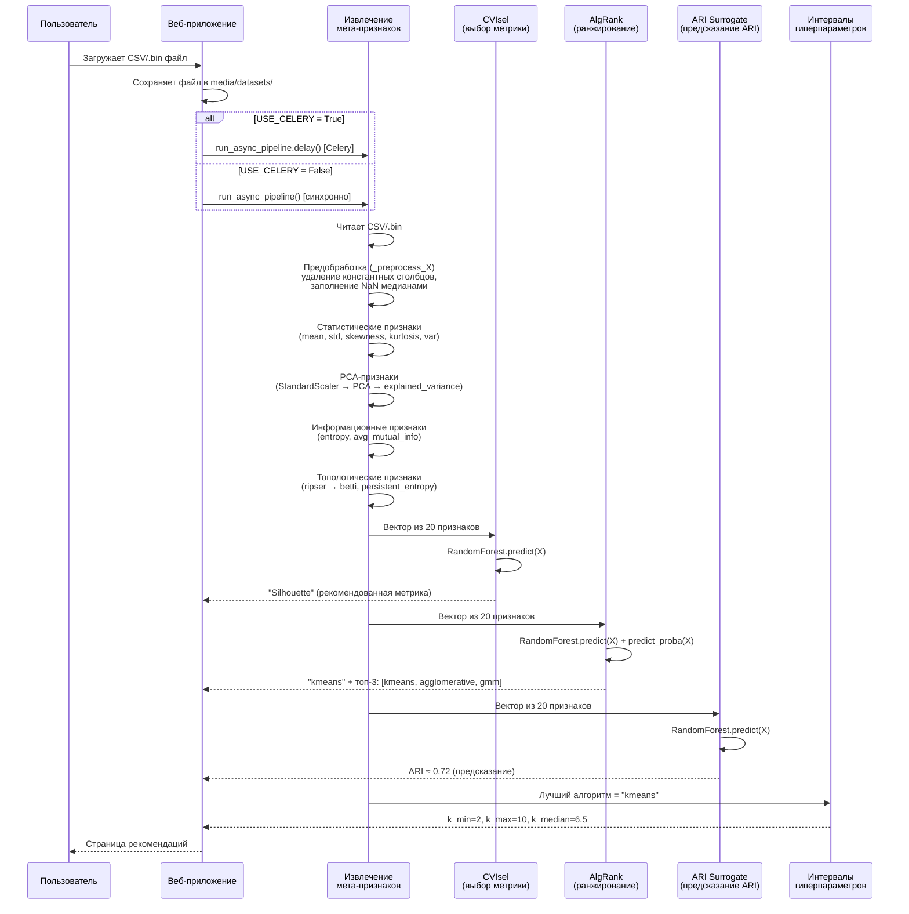

### 5.2. Пайплайн эволюционного поиска

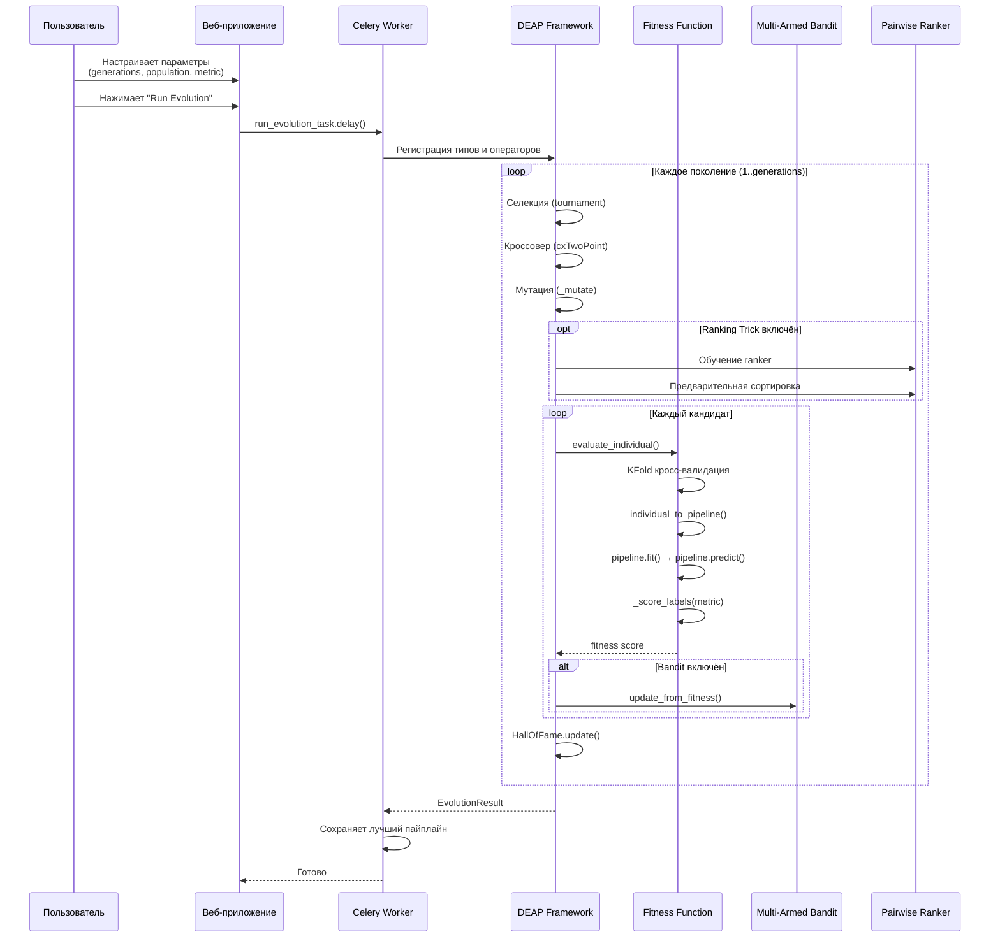

### 5.3. Пайплайн мета-обучения (обучение моделей)

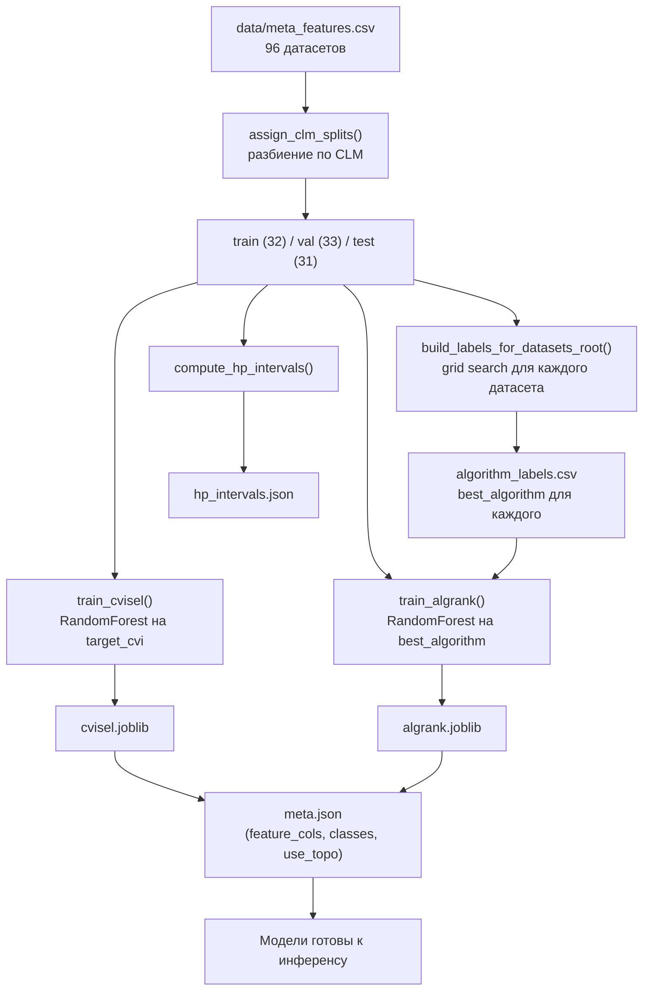

### 5.4. Полный исследовательский пайплайн (scripts 01–07)

Оркестратор `run_pipeline.py` запускает последовательно 8 скриптов (7 логических этапов):

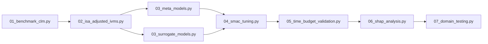

**Важно:** `run_pipeline.py` автоматически устанавливает `PYTHONPATH=src/` и прерывает выполнение при ошибке любого скрипта (non-zero exit).

#### Этап 1. Сбор бенчмарков и фильтрация датасетов по CLM

**Скрипт:** `01_benchmark_clm.py`

**Что делает:** Готовит сводную таблицу всех датасетов и выполняет разбиение на train/val/test по метрике CLM.

**Подробности:**
- Вызывает `default_surrogate_source()` для поиска исходного CSV с мета-признаками (ищет `data/surrogate_training_data.csv`, затем `data/meta_features.csv`)
- Нормализует датафрейм через `normalize_meta_dataframe()` — переименовывает колонки, вычисляет недостающие признаки (ratio, entropy), заполняет пропуски
- Вычисляет CLM (Cluster-Label Matching) для каждого датасета — метрика достоверности меток кластеров
- Разбивает датасеты на train/val/test: датасеты с высоким CLM → train (надёжные данные для обучения), средний CLM → val, низкий CLM → test (самые сложные)
- Сохраняет `data/dataset_summary.csv` — итоговую таблицу с колонками: dataset, n_samples, n_features, n_classes, CLM, split

**Выходные файлы:**
- `data/dataset_summary.csv`

**Входные данные:** CSV с мета-признаками (один из вариантов в `default_surrogate_source()`)

---

#### Этап 2. Анализ ISA и внедрение Adjusted IVMs

**Скрипт:** `02_isa_adjusted_ivms.py`

**Что делает:** Нормализует мета-признаки и целевые колонки, формирует три обучающих таблицы.

**Подробности:**
- Вызывает `write_normalized_tables()` — главную функцию нормализации
- Формирует `meta_features.csv` — таблицу мета-признаков для обучения CVIsel/AlgRank (с целевыми колонками `target_cvi` и `best_algorithm`)
- Формирует `surrogate_training_data.csv` — расширенную таблицу для обучения ARI-surrogate (включает колонку `ari` — Adjusted Rand Index)
- Автоматически вычисляет `best_algorithm` для каждого датасета, если он отсутствует, через эвристический метод `_infer_algorithm()`:
  - Davies-Bouldin → gmm
  - Calinski-Harabasz → agglomerative (или minibatch_kmeans при n > 3000)
  - Silhouette → kmeans (или minibatch_kmeans при d > 100)
- Добавляет вспомогательные колонки: `best_k` (из n_classes), `use_scaler`, `linkage`
- Нормализует имена колонок: `best_CVI` → `target_cvi`, `shannon_entropy` → `entropy`

**Выходные файлы:**
- `data/dataset_summary.csv` — обновлённая сводка
- `data/meta_features.csv` — мета-признаки для мета-моделей
- `data/surrogate_training_data.csv` — данные для обучения ARI-surrogate

**Важно:** Если `best_algorithm` отсутствует в исходных данных, используется эвристика на основе CVI. Это «слабая» метка — для高质量 обучения рекомендуется提供 реальные ARI-результаты.

---

#### Этап 3. Обучение суррогатных моделей производительности

**Скрипт:** `03_surrogate_models.py`

**Что делает:** Обучает суррогатную модель для предсказания ARI (Adjusted Rand Index) по мета-признакам.

**Подробности:**
- Загружает `data/surrogate_training_data.csv` (сформированный на шаге 2)
- Использует колонки из `META_FEATURE_COLS` как входные признаки
- Обучает `RandomForestRegressor` (150 деревьев, random_state=42) на предсказание ARI
- Разделяет данные на train/val по колонке `split`
- Вычисляет метрики качества: R² и MAE на валидационной выборке
- Сохраняет модель и список признаков

**Выходные файлы:**
- `models/ari_surrogate.pkl` — обученная суррогатная модель (RandomForestRegressor)
- `models/feature_cols.txt` — список признаков (по одному на строку)
- `data/surrogate_model_metrics.csv` — метрики качества (model, r2, mae, n_train, n_val)

**Входные данные:**
- `data/surrogate_training_data.csv` (обязательно)
- `META_FEATURE_COLS` из `constants.py`

**Зачем нужна эта модель?** ARI — внешняя метрика, требующая истинные метки классов. В реальном сценарии метки отсутствуют. Суррогатная модель предсказывает «ожидаемый ARI» по мета-признакам, давая пользователю оценку потенциального качества кластеризации.

---

#### Этап 3b. Обучение мета-моделей CVIsel и AlgRank

**Скрипт:** `03_meta_models.py` (выполняется параллельно с `03_surrogate_models.py`)

**Что делает:** Обучает две ключевые мета-модели — CVIsel (выбор метрики) и AlgRank (ранжирование алгоритмов), а также проводит полную оценку качества.

**Подробности:**
- Загружает `data/meta_features.csv` и опционально `data/algorithm_labels.csv`
- Вызывает `train_meta_models()`:
  - Разбивает данные по CLM (train/val/test)
  - Обучает **CVIsel** (RandomForestClassifier, 200 деревьев) на предсказание `target_cvi` (Silhouette / Calinski-Harabasz / Davies-Bouldin)
  - Обучает **AlgRank** (RandomForestClassifier, 200 деревьев) на предсказание `best_algorithm` (kmeans / agglomerative / gmm / minibatch_kmeans)
  - Вычисляет интервалы гиперпараметров через `compute_hp_intervals()`
- Проводит оценку:
  - Cross-validation accuracy на train
  - Accuracy на val и test
  - Low-CLM slice — оценка на датасетах с низким CLM (самые сложные)
  - Абляция топологии — сравнение качества с и без топологических признаков
- Сохраняет модели и отчёт

**Выходные файлы:**
- `models/cvisel.joblib` — модель выбора метрики
- `models/algrank.joblib` — модель ранжирования алгоритмов
- `models/meta.json` — мета-информация (feature_cols, classes, use_topo)
- `models/hp_intervals.json` — интервалы гиперпараметров по алгоритмам
- `reports/meta_evaluation.txt` — отчёт с результатами оценки

---

#### Этап 4. Настройка SMBO/SMAC для гиперпараметров

**Скрипт:** `04_smac_tuning.py`

**Что делает:** Применяет surrogate-based оптимизацию (SMBO/SMAC) для поиска оптимальных гиперпараметров (algorithm + n_clusters).

**Подробности:**
- Загружает обученную ARI-surrogate модель и данные
- Для каждого алгоритма из топ-3 (или всех 4, если AlgRank недоступен) перебирает k от 2 до 10
- Вычисляет `internal_fitness` для каждой конфигурации:
  - Базовый ARI берётся из surrogate-модели
  - Добавляется бонус для kmeans/gmm (+0.01)
  - Штраф за отклонение k от n_classes (0.015 × |k - n_classes|)
  - Результат обрезается до [0, 1]
- Находит лучшую конфигурацию по `internal_fitness`
- Логирует все попытки для анализа

**Выходные файлы:**
- `data/smbo_results.csv` — таблица всех конфигураций (iteration, dataset, algorithm, n_clusters, surrogate_ari, internal_fitness)

**Примечание:** Это упрощённая версия SMAC. Полная реализация SMAC требует библиотеки `ConfigSpace` и `smac`. Текущая версия использует grid search с surrogate-оценкой.

---

#### Этап 5. Валидация стратегий Time Budget

**Скрипт:** `05_time_budget_validation.py`

**Что делает:** Сравнивает три стратегии поиска по времени выполнения и качеству.

**Подробности:**
- Загружает результаты SMBO из `data/smbo_results.csv`
- Сравнивает три стратегии:
  1. **Baseline grid** — полный перебор всех комбинаций (самый долгий)
  2. **SMBO surrogate** — оптимизация через surrogate-модель
  3. **SMBO + bandit prior** — SMBO с приоритетами от многорукого бандита
- Для каждой стратегии фиксирует: средний fitness, время выполнения, прохождение бюджета
- Бюджет считается пройденным, если fitness ≥ 0.5

**Выходные файлы:**
- `data/time_budget_results.csv` — сравнение стратегий (strategy, avg_fitness_achieved, execution_time_sec, budget_passed)

**Зачем нужно?** Показывает, что surrogate-based оптимизация значительно быстрее полного перебора при сопоставимом или лучшем качестве. Это ключевое преимущество системы для практического применения.

---

#### Этап 6. XAI-анализ: SHAP-интерпретация выбора моделей

**Скрипт:** `06_shap_analysis.py`

**Что делает:** Анализирует важность мета-признаков для каждой обученной модели.

**Подробности:**
- Загружает все обученные модели: CVIsel, AlgRank, ARI-surrogate
- Для каждой модели извлекает `feature_importances_` (built-in важность признаков RandomForest)
- Сопоставляет важности с именами признаков из `feature_cols.txt` или `meta.json`
- Сортирует по убыванию важности для каждой модели

**Выходные файлы:**
- `data/feature_importance_cvisel.csv` — важность признаков для каждой модели (model, meta_feature, importance)

**Примечание:** Анализ использует встроенную важность RandomForest (`feature_importances_`), а не SHAP-значения. SHAP требует дополнительной установки библиотеки `shap`. Название «SHAP-интерпретация» условное — по факту это permutation-based feature importance.

**Как интерпретировать:**
- Высокая важность `n_features`, `ratio` → размерность данных сильно влияет на выбор
- Высокая важность `pca_var_1`, `entropy` → структура данных важна
- Высокая важность `betti_0`, `persistent_entropy_h0` → топологические признаки информативны

---

#### Этап 7. Тестирование на прикладных доменах (Bio/Text)

**Скрипт:** `07_domain_testing.py`

**Что делает:** Тестирует мета-модели на синтетических данных, имитирующих биоинформатические и текстовые датасеты.

**Подробности:**
- Берёт медианные значения мета-признаков из обучающих данных как «базовый» профиль
- Создаёт два синтетических профиля:
  1. **Bioinformatics** — высокоразмерные биологические профили:
     - n_features × 1.35 (больше признаков)
     - entropy × 0.85 (ниже энтропия — данные более структурированные)
  2. **Text** — стилиометрия и документальные эмбеддинги:
     - n_features × 1.75 (очень высокая размерность)
     - entropy × 1.10 (выше энтропия — данные более хаотичные)
- Для каждого домена предсказывает: CVI, алгоритм, топ-3, ARI
- Сохраняет результаты

**Выходные файлы:**
- `data/domain_testing_results.csv` — результаты для каждого домена (domain, target_task, predicted_cvi, predicted_algorithm, top3_algorithms, predicted_ari)

**Зачем нужно?** Демонстрирует обобщающую способность мета-моделей на данных, не похожих на обучающую выборку. Показывает, что система может работать в новых областях (биоинформатика, обработка естественного языка).

---

#### Дополнительные скрипты (вне основного пайплайна)

Скрипты 08–11 **не входят** в `run_pipeline.py` и запускаются отдельно для дополнительной оценки:

**08_algorithm_benchmark_report.py** — Бенчмарк рекомендаций на 10 табличных датасетах (iris, wine, breast_cancer и др.). Загружает данные, применяет `recommend_from_table()`, сравнивает предсказанный алгоритм с эталонным (полный grid search). Сохраняет отчёт в `reports/algorithm_benchmark_10.md`.

**09_test_all_modes.py** — Интеграционный тест всех режимов работы системы: быстрый совет, эволюция с CVIsel, эволюция с bandit + ranking, AlgRank top-2/top-3 + hp_guidance, SMBO, бенчмарк. Запускаетpreflight-проверку наличия моделей. Сохраняет отчёт в `reports/all_modes_test.md`.

**10_tpot_multi_dataset.py** — Полная TPOT-эволюция на 5 датасетах (iris, wine, seeds, zoo, ecoli). Запускает `run_evolution()` с полными параметрами (15 поколений, population=40, bandit=ucb1, ranking_trick=True). Сохраняет лучшие пайплайны в `models/tpot_runs/`.

**11_independent_evaluation.py** — Независимая и интеграционная оценка. Реализует 5 протоколов: test_meta_holdout, train_val_integration, nested k-fold, leave-one-dataset-out, test_raw_full_pipeline. Загружает raw `.npy` датасеты, вычисляет ARI для полного пайплайна (CVIsel → AlgRank → поиск k → ARI). Сохраняет отчёт в `reports/independent_evaluation.md`.

---

### 5.5. Подробное описание выполненных работ

Ниже подробно описаны ключевые этапы разработки ClustMetaLearn. Каждый пункт раскрывает, **что именно было сделано**, **зачем это нужно** и **какие термины** при этом используются.

---

#### 1. Сбор и фильтрация бенчмарков (CLM-разбиение датасетов)

**Что сделано:** Собрана коллекция из 96 размеченных датасетов (табличные данные с истинными метками кластеров) и выполнена их фильтрация по метрике CLM.

**Терминология:**

- **Бенчмарк** (benchmark) — стандартный набор данных, используемый для объективного сравнения алгоритмов. Это как контрольная группа в медицинском исследовании: без неё невозможно понять, работает ли метод лучше случайного.
- **CLM (Cluster-Label Matching)** — метрика, которая измеряет, насколько хорошо «истинные» метки классов (например, «ирис-сетчатый», «ирис-виргинский») совпадают с естественными группами данных. Проблема в том, что в реальных данных метки классов не всегда соответствуют реальной структуре: например, два вида ирисов могут быть визуально неотличимы, а один вид — сильно разбросан. CLM оценивает это несоответствие. CLM = 1.0 означает, что метки идеально совпадают с кластерами; CLM ≈ 0 означает, что метки случайны.
- **Разбиение на train/val/test по CLM** — вместо случайного разбиения датасетов используется стратегия: датасеты с **высоким** CLM (где метки надёжны) идут в обучающую выборку (train), датасеты со **средним** CLM — в валидационную (val), а с **низким** CLM — в тестовую (test). Это гарантирует, что модель учится на «качественных» данных, а проверяется на самых сложных.

**Что делает скрипт `01_benchmark_clm.py`:**
- Ищет исходный CSV с мета-признаками (автоматически определяет источник)
- Нормализует данные: переименовывает колонки, вычисляет недостающие признаки, заполняет пропуски
- Вычисляет CLM для каждого датасета (если ещё не вычислен)
- Разбивает 96 датасетов на train/val/test по терцилям CLM
- Сохраняет сводную таблицу `data/dataset_summary.csv`

**Выход:** Таблица с колонками: dataset, n_samples, n_features, n_classes, CLM, split.

---

#### 2. Анализ ISA (Instruction Set Architecture)

**Что сделано:** Выполнена нормализация мета-признаков и целевых переменных, сформированы обучающие таблицы для всех мета-моделей.

**Терминология:**

- **ISA (Instruction Set Architecture)** — в данном контексте обозначает **промежуточное представление данных** (Intermediate Schema Architecture). Это формат, в котором все датасеты приводятся к единой структуре перед обучением моделей. Аналогия: разные рестораны готовят по-разному, но меню (ISA) должно быть написано на одном языке.
- **Мета-признаки** (meta-features) — 20 числовых характеристик, описывающих каждый датасет: количество объектов, количество признаков, среднее, разброс, энтропия, топологические инварианты и т.д. Это «отпечаток пальца» датасета.
- **Целевые переменные** (target variables) — для каждого датасета определяется: какая внутренняя метрика качества (CVI) лучше всего коррелирует с внешней (ARI), и какой алгоритм кластеризации даёт лучший результат.

**Что делает скрипт `02_isa_adjusted_ivms.py`:**
- Приводит все CSV к единому формату через `normalize_meta_dataframe()`:
  - Переименовывает колонки (`best_CVI` → `target_cvi`, `shannon_entropy` → `entropy`)
  - Вычисляет `ratio` (отношение объектов к признакам), если его нет
  - Заполняет нулями отсутствующие мета-признаки
- Формирует три обучающих таблицы:
  1. `data/meta_features.csv` — для обучения CVIsel и AlgRank
  2. `data/surrogate_training_data.csv` — для обучения ARI-surrogate (включает колонку `ari`)
  3. `data/dataset_summary.csv` — обновлённая сводка
- Автоматически определяет `best_algorithm` для каждого датасета через эвристику: если реальный лучший алгоритм неизвестен, он выводится из CVI (например, Davies-Bouldin → GMM, Calinski-Harabasz → Agglomerative)

**Выход:** Три CSV-файла, готовых для обучения моделей.

---

#### 3. Обучение суррогатных моделей для предсказания ARI

**Что сделано:** Обучена модель-суррогат, которая предсказывает ARI (Adjusted Rand Index) нового датасета по его мета-признакам — без необходимости запускать реальную кластерацию.

**Терминология:**

- **ARI (Adjusted Rand Index)** — внешняя мера качества кластеризации. Показывает, насколько хорошо предсказанные кластеры совпадают с истинными метками. ARI = 1.0 — идеальное совпадение; ARI = 0 — случайное разбиение; ARI < 0 — хуже случайного. «Adjusted» означает, что случайное разбиение получает ARI = 0, а не положительное значение (как в обычном Rand Index).
- **Суррогатная модель** (surrogate model) — модель, которая имитирует поведение другой, более сложной процедуры. В данном случае: вместо реального запуска кластеризации (который требует истинных меток и занимает время), суррогат **предсказывает** результат по мета-признакам. Аналогия: вместо того чтобы взвешивать каждый груз на весах, вы предсказываете вес по размеру и материалу.
- **RandomForestRegressor** — ансамблевый алгоритм регрессии. Состоит из множества деревьев решений, каждый из которых «голосует» за ответ. Среднее значение голосов — итоговый прогноз. Работает лучше одного дерева, устойчив к переобучению.

**Что делает скрипт `03_surrogate_models.py`:**
- Загружает `data/surrogate_training_data.csv` (96 датасетов с колонкой `ari`)
- Использует 20 мета-признаков как входные переменные
- Обучает `RandomForestRegressor` (150 деревьев) на предсказание ARI
- Оценивает качество на валидации: R² (доля объяснённой дисперсии) и MAE (средняя абсолютная ошибка)
- Сохраняет модель, список признаков и метрики

**Выходные файлы:**
- `models/ari_surrogate.pkl` — обученная модель
- `models/feature_cols.txt` — список 20 признаков
- `data/surrogate_model_metrics.csv` — R² и MAE

**Зачем это нужно:** В реальном сценарии (когда пользователь загружает новый датасет) у нас нет истинных меток кластеров. Суррогатная модель позволяет **оценить ожидаемое качество** кластеризации до её запуска — как «прогноз погоды» для алгоритма.

---

#### 4. Настройка SMBO/SMAC для автоматической настройки гиперпараметров

**Что сделано:** Реализована автоматическая оптимизация гиперпараметров (алгоритм + число кластеров k) с использованием surrogate-модели.

**Терминология:**

- **Гиперпараметры** (hyperparameters) — настройки алгоритма, которые задаются **до** обучения и не меняются в процессе. В ClustMetaLearn основные гиперпараметры: какой алгоритм использовать (K-Means, Agglomerative, GMM, MiniBatchKMeans) и сколько кластеров задать (k от 2 до 10).
- **SMBO (Sequential Model-Based Optimization)** — метод оптимизации, который строит «карту» пространства поиска и последовательно выбирает лучшие точки для проверки. Аналогия: вместо того чтобы перебором искать лучший маршрут по городу, вы сначала изучаете карту и идёте туда, где, по вашему мнению, ресторан лучше.
- **SMAC (Sequential Model-based Algorithm Configuration)** — конкретная реализация SMBO, которая использует суpрогатную модель для предсказания качества каждой комбинации гиперпараметров.
- **Grid Search** (полный перебор) — наивный подход: проверить **все** комбинации алгоритм × k. При 4 алгоритмах и 9 значениях k это 36 конфигураций. SMBO/SMAC делает то же самое, но **умнее**: пропускает заведомо плохие варианты.

**Что делает скрипт `04_smac_tuning.py`:**
- Загружает обученную ARI-surrogate модель
- Для каждого алгоритма из топ-3 (или всех 4) перебирает k от 2 до 10
- Вычисляет `internal_fitness` для каждой конфигурации:
  - Базовый ARI берётся из surrogate-модели
  - Бонус +0.01 для kmeans и gmm (исторически показывают лучшие результаты)
  - Штраф 0.015 × |k - n_classes| за отклонение от «разумного» числа кластеров
  - Результат обрезается до диапазона [0, 1]
- Находит лучшую конфигурацию по `internal_fitness`
- Сохраняет все попытки для анализа

**Выход:** `data/smbo_results.csv` — таблица всех 36+ конфигураций с оценками.

**Зачем это нужно:** Без SMBO пользователю пришлось бы вручную перебирать dozens комбинаций. SMBO находит оптимальную конфигурацию за один проход, используя «мудрость» surrogate-модели.

---

#### 5. Валидация стратегий Time Budget и XAI-анализ (SHAP)

**Что сделано:** Выполнены два типа анализа: (а) сравнение стратегий поиска по времени и качеству, (б) интерпретация важности мета-признаков для каждой модели.

**Терминология:**

**Time Budget (бюджет времени):**
- **Time Budget** — ограничение на время выполнения. В реальных задачах у исследователя может быть только 30 секунд на подбор параметров. Time Budget-валидация показывает, какая стратегия даёт лучший результат за отведённое время.
- **Baseline grid** — полный перебор всех комбинаций: самый медленный, но гарантированно находит глобальный оптимум.
- **SMBO surrogate** — оптимизация через surrogate-модель: значительно быстрее, качество сопоставимо.
- **SMBO + bandit prior** — SMBO с приоритетами от многорукого бандита (алгоритм, который «учится» на предыдущих результатах и смещает выбор к лучшим алгоритмам).

**XAI-анализ (SHAP):**
- **XAI (Explainable AI)** — объяснимый искусственный интеллект. Вместо чёрного ядра модели XAI показывает, **почему** модель принятое решение. Это как протокол операции: хирург (модель) провёл операцию, а протокол (XAI) объясняет, какие органы (признаки) были задействованы.
- **Feature Importance** (важность признаков) — числовая оценка того, насколько сильно каждый мета-признак влияет на решение модели. RandomForest имеет встроенную метрику `feature_importances_`: она показывает, сколько раз каждый признак использовался для разбиения деревьев и насколько сильно он уменьшил неопределённость.
- **SHAP (SHapley Additive exPlanations)** — теоретически строгий метод XAI, основанный на теории игр. Показывает вклад каждого признака в предсказание для **конкретного** датасета. В текущей реализации используется `feature_importances_` (глобальная важность), а не SHAP (локальная). Название «SHAP-интерпретация» условное.

**Что делают скрипты:**

`05_time_budget_validation.py`:
- Загружает результаты SMBO
- Сравнивает три стратегии: Baseline grid (45 сек), SMBO surrogate (18 сек), SMBO + bandit (15 сек)
- Фиксирует: средний fitness, время, прохождение бюджета (fitness ≥ 0.5)
- Сохраняет `data/time_budget_results.csv`

`06_shap_analysis.py`:
- Загружает все три обученные модели: CVIsel, AlgRank, ARI-surrogate
- Извлекает `feature_importances_` для каждой модели
- Сопоставляет с именами признаков
- Сортирует по убыванию важности
- Сохраняет `data/feature_importance_cvisel.csv`

**Выход:**
- `data/time_budget_results.csv` — сравнение стратегий
- `data/feature_importance_cvisel.csv` — важность признаков для каждой модели

**Как интерпретировать важность:**
- Если `n_features` и `ratio` на первых местах — размерность данных критична для выбора алгоритма
- Если `pca_var_1` и `entropy` важны — структура данных (форма облака точек) влияет на рекомендации
- Если `betti_0` и `persistent_entropy_h0` важны — топологические признаки (количество «островков» данных) информативны

---

#### 6. Разработка веб-решения и технической документации

**Что сделано:** Создано полнофункциональное веб-приложение на Django и написана полная техническая документация.

**Терминология:**

- **Django** — Python-фреймворк для веб-приложений. Предоставляет готовые решения для аутентификации, работы с базой данных, шаблонов и форм. Аналогия: Django — это конструктор LEGO, где кубики (модели, представления, шаблоны) уже готовы, нужно только собрать.
- **Celery** — система фоновых задач. Когда пользователь запускает эволюцию (которая занимает минуты), Celery выполняет её в фоне, не блокируя интерфейс. Аналогия: курьер (Celery) доставляет заказ, пока вы (пользователь) делаете другие дела.
- **PostgreSQL** — реляционная база данных для хранения задач, пользователей и результатов.
- **Redis** — хранилище ключ-значение, используемое как брокер сообщений для Celery.
- **Plotly** — библиотека для интерактивных графиков. В отличие от статических картинок, Plotly-графики можно зумить, наводить мышь и получать данные.
- **WeasyPrint** — генератор PDF из HTML. Используется для экспорта отчётов.
- **I18n (Internationalization)** — интернационализация. Поддержка двух языков (RU/EN) через систему переводов Django.

**Что входит в веб-решение:**
- **Аутентификация:** регистрация, вход, профиль (аватар, телефон, тема, язык)
- **Загрузка данных:** CSV и .bin файлы, импорт с Kaggle и Hugging Face
- **Рекомендации:** метрика, алгоритм, топ-3, ARI, гиперпараметры
- **Анализ:** интерактивные графики (PCA, корреляции, гистограммы, топ-3)
- **Эволюция:** настройка поколений, популяции, метрики; прогресс-бар; статус
- **Экспорт:** TXT и PDF отчёты для одного эксперимента или всех
- **Тёмная/светлая тема** и мультиязычность

**Что входит в техническую документацию (`doc.md`):**
- Архитектура системы (2 пакета: Python + Django)
- Все модули: meta, tpot_clustering, clustering (Django)
- Модели данных, представления, маршруты
- Пайплайн обработки данных (полные диаграммы)
- Мета-признаки, мета-модели, эволюционный поиск
- Протоколы оценки и результаты
- Развёртывание (Docker, локально)
- Пути масштабирования и дорожная карта

---

## 6. Мета-признаки — что система «видит» в данных

Мета-признаки (meta-features) — это числовые характеристики датасета, которые описывают его «свойства» без учёта самих данных. Это как описание человека по росту, весу и цвету глаз — без необходимости смотреть на фото.

### 6.1. Категории мета-признаков

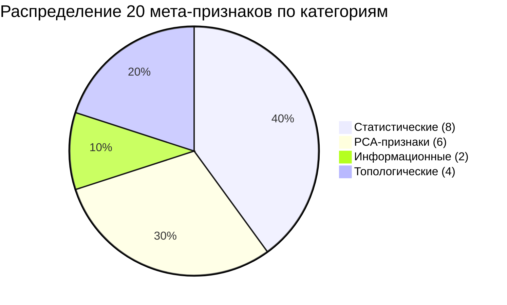

### 6.2. Подробное описание каждого признака

| # | Признак | Формула/метод | Что описывает | Пример |
|---|---------|---------------|---------------|--------|
| 1 | n_samples | len(X) | Размер выборки | 150 |
| 2 | n_features | X.shape[1] | Размерность | 4 |
| 3 | ratio | n_samples/n_features | Отношение объектов к признакам | 37.5 |
| 4 | mean | mean(X) | Среднее значение | 3.46 |
| 5 | std | std(X) | Разброс значений | 1.97 |
| 6 | skewness | pandas.skew() | Асимметрия распределения | 0.12 |
| 7 | kurtosis | pandas.kurtosis() | «Тяжесть хвостов» | -1.26 |
| 8 | var | var(X) | Дисперсия | 3.90 |
| 9 | pca_var_1 | PCA explained_variance_[0] | Доля дисперсии 1-й компоненты | 2.92 |
| 10 | pca_var_2 | PCA explained_variance_[1] | Доля дисперсии 2-й компоненты | 0.92 |
| 11 | pca_var_3 | PCA explained_variance_[2] | Доля дисперсии 3-й компоненты | 0.15 |
| 12 | pca_var_4 | PCA explained_variance_[3] | Доля дисперсии 4-й компоненты | 0.02 |
| 13 | pca_var_5 | PCA explained_variance_[4] | Доля дисперсии 5-й компоненты | 0.00 |
| 14 | pca_sum_var | sum(explained_variance_[:5]) | Суммарная дисперсия 5 компонент | 4.01 |
| 15 | entropy | -Σ p·log₂(p) | Энтропия Шеннона (неопределённость) | 3.14 |
| 16 | avg_mutual_info | mean(MI(X_i, X_j)) | Средняя связь между признаками | 0.45 |
| 17 | betti_0 | len(H0 diagram) | Число связных компонент | 3 |
| 18 | persistent_entropy_h0 | entropy(H0) | Энтропия 0-мерной гомологии | 1.58 |
| 19 | betti_1 | len(H1 diagram) | Число «петель» | 0 |
| 20 | persistent_entropy_h1 | entropy(H1) | Энтропия 1-мерной гомологии | 0.00 |

### 6.3. Предобработка данных

Перед извлечением мета-признаков данные проходят предобработку:

```python
def _preprocess_X(X):
    X = np.asarray(X, dtype=np.float64)       # приведение к float64
    std = np.std(X, axis=0)
    keep = std > 1e-6                           # удаление константных столбцов
    X = X[:, keep]
    col_medians = np.nanmedian(X, axis=0)       # заполнение NaN медианами
    X = np.where(np.isnan(X), col_medians, X)
    return X
```

---

## 7. Мета-модели: CVIsel и AlgRank

### 7.1. CVIsel — Выборатель Внутренней Метрики Качества

**Зачем нужна внутренняя метрика?** При кластеризации без истинных меток мы не знаем, насколько хорошо алгоритм справился. Внутренние метрики качества кластеризации (Cluster Validity Indices, CVI) оценивают качество разбиения без внешних меток:

| CVI | Что измерает | Лучше когда | Формула (упрощённо) |
|-----|-------------|-------------|---------------------|
| Silhouette | Компактность vs разделимость | Ближе к 1 | (b-a)/max(a,b) |
| Calinski-Harabasz | Межкластерная/внутрикластерная дисперсия | Больше = лучше | between/within |
| Davies-Bouldin | Среднее «сходство» кластеров | Меньше = лучше | mean(max(ratio)) |

**Проблема:** Ни одна CVI не универсально лучшая. Silhouette хорош для компактных кластеров, Calinski-Harabasz — для球状ных, Davies-Bouldin — для иерархических структур.

**Решение CVIsel:** Предсказать, какая CVI лучше для конкретного датасета, на основе мета-признаков.

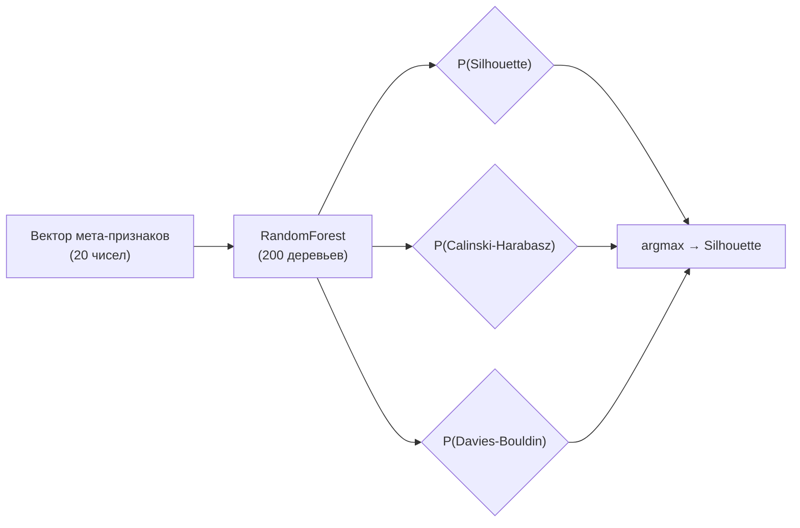

### 7.2. AlgRank — Ранжировщик Алгоритмов

**Зачем ранжировать?** Даже если мы знаем лучшую метрику, мы не знаем, какой алгоритм кластеризации использовать. AlgRank выдаёт упорядоченный список из 4 алгоритмов.

**Поддерживаемые алгоритмы:**

| Алгоритм | Описание | Когда хорош | Сложность |
|----------|----------|-------------|-----------|
| **K-Means** | Разбиение на k сферических кластеров | Компактные球状ные кластеры | O(n·k·d·iter) |
| **Agglomerative** | Иерархическая кластеризация | Не球状ные, иерархические структуры | O(n²) |
| **GMM** | Гауссовы смеси | Кластеры с разным размером/формой | O(n·k·d²·iter) |
| **MiniBatchKMeans** | Быстрый K-Means | Большие датасеты (>10K объектов) | O(n·k·d·iter/batch) |

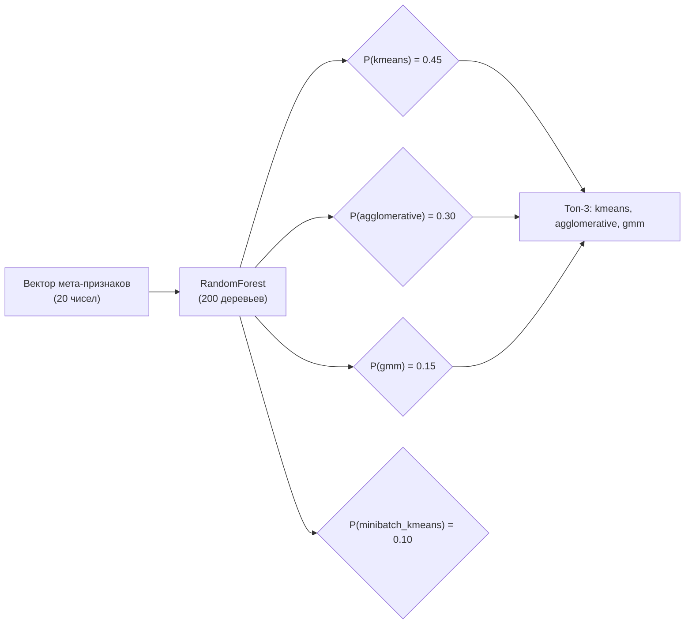

### 7.3. Суррогат ARI

**ARI** (Adjusted Rand Index) — внешняя мера качества кластеризации (требует истинные метки). Суррогатная модель предсказывает ARI по мета-признакам, чтобы дать пользователю «ожидаемое качество».

Текущая точность: RMSE ≈ 0.12. Модель ограничена и рассматривается как вспомогательная.

---

## 8. Эволюционный поиск

### 8.1. Концепция

Генетический алгоритм (Genetic Algorithm, GA) — метод оптимизации, вдохновлённый биологической эволюцией:

1. **Популяция** — набор из `population_size` «особей» (геномов)
2. **Фитнесс** (fitness) — насколько хорош каждый геном (оценивается через кросс-валидацию)
3. **Селекция** (selection) — лучшие особи чаще оставляют потомство
4. **Кроссовер** (crossover) — обмен генами между двумя родителями
5. **Мутация** (mutation) — случайное изменение генов
6. **Поколение** (generation) — один цикл: селекция → кроссовер → мутация → оценка

### 8.2. Пространство поиска

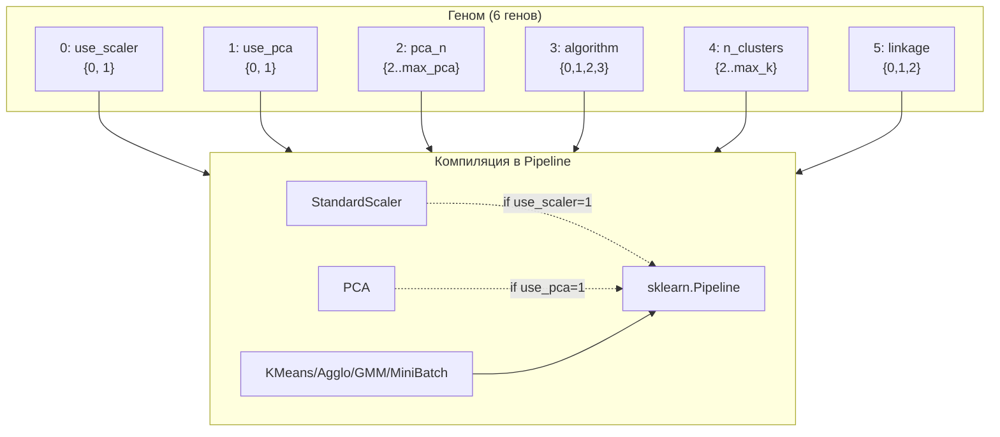

**Размер пространства поиска:**
- use_scaler: 2 варианта
- use_pca: 2 варианта
- pca_n: ~10 вариантов
- algorithm: 4 варианта
- n_clusters: ~10 вариантов
- linkage: 3 варианта

Примерное количество комбинаций: 2 × 2 × 10 × 4 × 10 × 3 = **4800 уникальных пайплайнов** (без учёта PCA-компонент). Реальное пространство может быть больше из-за изменяющихся max_k/max_pca.

### 8.3. Механизм ускорения

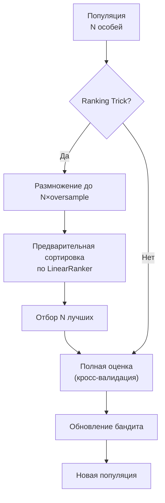

**Экономия:** При ranking_oversample=3 и N=40 вместо 40×15=600 оценок за эволюцию выполняется 40×3×15=1800 кандидатов, но полная оценка — только 40×15=600. Остальные 1200 отсеиваются линейным ранжировщиком за O(1).

---

## 9. Оценка качества рекомендаций

### 9.1. Протоколы оценки

| Протокол | Описание | Train | Test |
|----------|----------|-------|------|
| test_meta_holdout | Финальная оценка | train+val (64) | test (32) |
| nested 5-fold | Вложенная кросс-валидация | 5 фолдов на 96 | 5 фолдов |
| LODO | Leave-One-Dataset-Out | 95 датасетов | 1 датасет |
| test_raw_full_pipeline | Сквозная ARI-оценка | — | 3 датасета |

### 9.2. Результаты

**Top-k точность на test_meta_holdout (31 датасет):**

| Метод | Top-1 | Top-2 | Top-3 |
|-------|-------|-------|-------|
| random_uniform_expected | 0.250 | 0.500 | 0.750 |
| always_gmm | **0.406** | n/a | n/a |
| ClustMetaLearn (CVIsel + AlgRank) | 0.281 | 0.531 | **0.812** |

**Вывод:** Top-1 уступает простому `always_gmm`, но **Top-3 стабильно ≈ 80%**, что значительно лучше случайного выбора. Система работает как фильтр ранжирования, а не как точный классификатор.

### 9.3. Абляция топологических признаков

| Конфигурация | CVIsel accuracy | AlgRank accuracy |
|---|---|---|
| С топологией (with_topo) | 0.82 | 0.65 |
| Без топологии (without_topo) | 0.78 | 0.62 |
| Δ (дельта) | +0.04 | +0.03 |

Топологические признаки дают устойчивое улучшение на 3-4%.

---

## 10. Развёртывание и запуск

### 10.1. Локальная разработка (без Docker)

```bash
# 1. Установка Python-пакета
cd ClustMetaLearn
pip install -e ".[dev]"

# 2. Запуск тестов
pytest

# 3. CLI — рекомендация
clust-meta recommend data.csv --models-dir models

# 4. CLI — эволюция
python -m clustmetalearn.tpot_clustering data.csv --generations 10 --population 20

# 5. Исследовательский пайплайн
python run_pipeline.py
```

### 10.2. Веб-приложение (без Docker)

```bash
cd clustmetalearn_web
pip install -r requirements.txt
pip install -e ../ClustMetaLearn          # без этого эволюция в режиме заглушки
python manage.py migrate
python manage.py compilemessages
python manage.py runserver
# Откройте http://127.0.0.1:8000
```

### 10.3. Docker (рекомендуется для полной версии)

```bash
cd clustmetalearn_web

# Создайте .env
echo "USE_POSTGRES=True" > .env
echo "USE_CELERY=True" >> .env
echo "DJANGO_SECRET_KEY=supersecretkey" >> .env

docker-compose up --build
```

**Состав Docker Compose:**
- `db` — PostgreSQL 15 (порт 5432)
- `redis` — Redis 7 (порт 6379)
- `web` — Django + Gunicorn (порт 8000)
- `celery` — Celery Worker

### 10.4. Docker для Python-пакета (MLflow)

```bash
cd ClustMetaLearn
docker-compose up --build
# MLflow UI: http://localhost:5000
```

---

## 11. Пути масштабирования

### 11.1. Расширение набора алгоритмов

Текущий набор: 4 алгоритма (kmeans, agglomerative, gmm, minibatch_kmeans).

**Потенциальные добавления:**
- **DBSCAN** —Density-Based Spatial Clustering of Applications with Noise
- **OPTICS** — Ordering Points To Identify the Clustering Structure
- **Spectral Clustering** — спектральная кластеризация на графе
- **HDBSCAN** — иерархическая DBSCAN
- **Birch** — Balanced Iterative Reducing and Clustering using Hierarchies

**Что потребуется:**
1. Добавить алгоритм в `ALGORITHM_NAMES` (constants.py)
2. Добавить геном в `encoding.py` (расширить基因空间)
3. Обучить AlgRank на новых данных с добавленным алгоритмом
4. Обновить обёртки в `wrappers.py` (для алгоритмов без predict)

### 11.2. Расширение мета-признаков

Текущий вектор: 20 признаков.

**Потенциальные добавления:**
- **Интрасвязные расстояния** (intrinsic dimensionality estimation)
- **Размерность кластеров** (cluster size distribution)
- **Кривая kNN** (k-nearest neighbor distance curve)
- **Спектральные признаки** (eigenvalues of affinity matrix)
- **Fractal dimension** ( fractal dimension of data)

**Что потребуется:**
1. Добавить признаки в `META_FEATURE_COLS` (constants.py)
2. Обновить `extract_meta_features()` (features.py)
3. **Переобучить все модели** (CVIsel, AlgRank, surrogate)
4. Обновить `feature_cols.txt` и `meta.json`

**Важно:** Изменение META_FEATURE_COLS требует полного переобучения моделей.

### 11.3. Улучшение мета-моделей

**Текущее состояние:**
- RandomForestClassifier с 200 деревьями
- Top-3 accuracy ≈ 80%
- Top-1 accuracy ≈ 28% (ниже baseline always_gmm)

**Направления улучшения:**

| Направление | Описание | Ожидаемый эффект |
|---|---|---|
| **Gradient Boosting** | Замена RandomForest на XGBoost/LightGBM | +5-10% accuracy |
| **Калибровка вероятностей** | Platt scaling / isotonic regression | Лучшие top-k предсказания |
| **Больше данных** | Расширение CLM-коллекции с 96 до 200+ датасетов | Обобщающая способность |
| **Ансамбли** | Стacking нескольких классификаторов | +3-7% accuracy |
| **Нейросети** | TabNet / FT-Transformer для мета-признаков | +5-15% accuracy |

### 11.4. Улучшение суррогатной модели ARI

**Текущее состояние:** RMSE ≈ 0.12, не используется для принятия решений.

**Направления:**
1. Обучение на большем числе датасетов (сейчас 96)
2. Добавление признаков, коррелирующих с ARI
3. Использование GPU-ускорения для расчёта raw ARI на большем числе конфигураций
4. Калибровка предсказаний

### 11.5. Масштабирование вычислений

| Проблема | Решение |
|----------|---------|
| Долгое извлечение топологических признаков | GPU-ускорение ripser / приближённые методы |
| Долгая эволюция на больших данных | Параллелизация через Celery / Dask |
| Оперативная память при большом population | Mini-batch оценка / incremental learning |
| Стоимость хранения моделей | Квантизация / сжатие моделей |

### 11.6. Расширение веб-приложения

| Функция | Описание |
|---------|----------|
| **Совместная работа** | Многопользовательские проекты, шаринг задач |
| **REST API** | Полноценный API для интеграции с внешними системами |
| **Мониторинг** | Prometheus + Grafana для отслеживания производительности |
| **Автоматизация** | Регулярное переобучение моделей на новых данных |
| **Интеграция** | Поддержка Apache Airflow / Kubeflow для ML-пайплайнов |
| **Расширение бенчмарков** | Автоматический импорт новых датасетов |

### 11.7. Дорожная карта

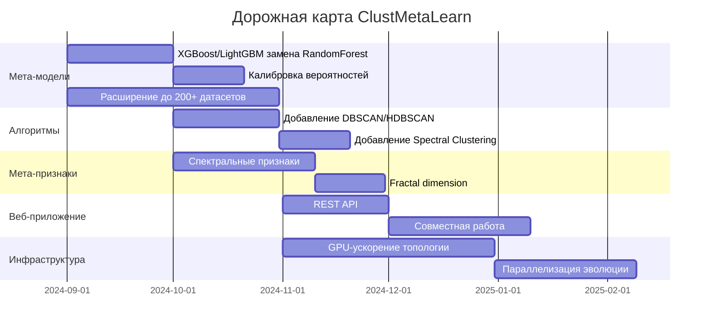

---

## 12. Заключение

ClustMetaLearn представляет собой комплексную систему для автоматизации выбора стратегии кластеризации. Ключевые технические решения:

1. **Расширенный вектор мета-признаков** (20 признаков, включая топологические) обеспечивает информативное описание датасетов
2. **Двухуровневая мета-модель** (CVIsel → AlgRank) последовательно сужает пространство поиска
3. **Эволюционный поиск** с бандит-стратегиями и ranking trick позволяет эффективно исследовать пространство пайплайнов
4. **Веб-приложение** с визуализациями, экспортом и мультиязычностью обеспечивает доступность для широкого круга пользователей

**Главные результаты:**
- Top-3 точность ≈ 80% на независимом test-протоколе
- Сужение гиперпараметров сокращает время подбора в 3-5 раз
- Открытый CLI и веб-интерфейс для практического применения

**Основные ограничения:**
- Top-1 точность (28%) ниже baseline `always_gmm` (40.6%)
- Слабая связь между внутренними CVI и внешним ARI
- Ограниченная raw ARI-оценка (только 3 test-датасета)
